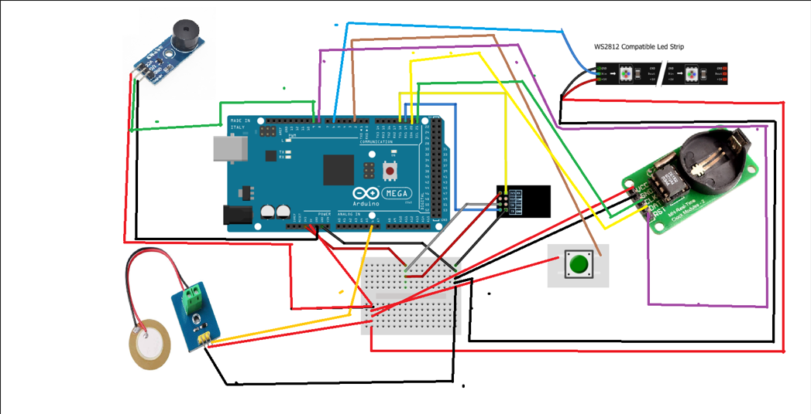

# DMP_Smart_Watch

The project represent a smat alarm clock, that the user can interact with and see different behaviours. Usually alarm clock are made with a snooze button and most of us like to hit it pretty often. In order to prevent the ariving late to school or work, because the user wants to sleep a little more, the smart alarm clock has a new integrated behaviour just for that. Having visual and auditory stimulus this will make the process of waking up a little easier.

## Languages and programs used
* C
* C++
* Arduino IDE

## Functionalities

The user sets the hour he/she wants to wake up on the website made specially for this, and the wi-fi module sends this data to the board where it will be stored in memory. Once the alarm starts ringing, the neopixels wil turn on in a radnom manner and having different colors. If the user wants to hit the snooze button the alarm clock enters in angry mode and it will start ringing faster and the leds will turn led, preventing in this way to fall back to sleep.

## Schematic 

## Implementation
Mostly the part that simulates concurrence, where the buzzer start ringing and te neopixels are turn on and off following a pattern. In order to do that I had to define some classes, which had variables like pin, ledcolor, but most importantly TimeOn and TimeOff. This time dictates the number of miliseconds the buzzer or one pixel is on, and the other the time the pixel will turn off. And to create concurrence if I set the buzzer to start at 100 miliseconds and the neopixel at 150 miliseconds, the time between them will be so small that it will create a sense on concurency. 

For the wifi and clock part is I have made a function that will compute the current time calling the RTC function and then interpreting the input received by the serial communication that happens between the wifi module and the board. 

The RTC module uses a I2C communication protocol. This is a bus interface connection incorporated into the devices.  SDA and SCL. Both of these lines are pulled high. 
* SDA = transfer of data 
* SCL = clock signal

It operates in 2 modes: slave and master. Each data send from RTC through SDA pin is synchronized by a high to the low pulse of each clock on the SCL line.  
The data line cannot change when the clock line is high, it can only change when the clock line is low.  

The fact that the RTC module has a battery it will to give accurate time and data continuously.  

The interrupt behaviour is given by the pushbutton, that is connected to pin 2 on the board. The pin 2 on Mega board has INT0, that can be used in order to attach an interrupt and bind it to a function or using it with the ISR register.  

Once the interrupt is attached, everytime the user presses the button the system will interrupt and the function attached will be executed before continuing.s

